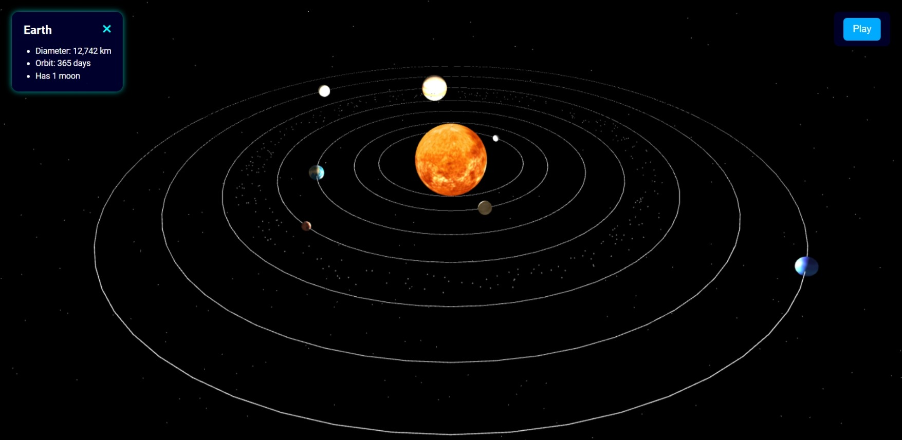

# 🌌 Celestia: The Solar Symphony

**Celestia** is a fully immersive 3D solar system simulation built using **Three.js**, designed to educate, engage, and mesmerize. Featuring the sun, orbiting planets, orbit rings, asteroid belt — all rendered in real-time with interactive elements. Experience the cosmos like never before!

---

## 📁 Live Preview

🚀 [Click here to explore Celestia](https://tasnim-ferdous.github.io/Websites/Celestia/index.html)

---

## 📷 Screenshot


---

## 🚀 Features

- 🌞 **Radiating Sun**: A glowing, brightened sun at the center of it all.
- 🌍 **Realistic Planetary Orbits**: Watch each planet gracefully orbit in space.
- 💫 **Animated Asteroid Belt**: A beautiful ring of drifting space rocks.
- 🛰️ **Free Camera Controls**: Navigate through space with full 3D freedom.
- 🎧 **Ambient Sci-Fi Music**: Looped background sound with auto-play after interaction.
- 🔘 **Play/Pause Animation**: Control the entire solar movement with a single button.
- ℹ️ **Interactive Info Panel**: Click celestial objects to learn fun facts.

---

## 🛠️ Tech Stack

- [**Three.js**](https://threejs.org/) for 3D rendering  
- **JavaScript** for logic & interactivity  
- **HTML5** & **CSS3** for layout and design  
- **Sci-fi audio** for immersive background

---

## 🎮 Controls

- **Mouse Drag** — Move the camera
- **Scroll** — Zoom in/out
- **Click** — Open object info panel
- **Play/Pause Button** — Control the animation

---

## 📁 Folder Structure

```
📦 Pet-Adoption-Matching
 ┣ 📦 Favicon           # Favicon image folder
 ┣ 📜 index.html        # Main landing page
 ┣ 📜 style.css         # Styling for all pages
 ┣ 📜 script.js         # Matching logic and UI interactivity
 ┣ 📜 README.md         # You're reading it!
 ┗ 📜 LICENSE           # MIT License
```

---

## ✨ Creator

💌 [tasnimferdous2007@gmail.com]  
🔗 [LinkedIn](https://www.linkedin.com/in/md-tasnimferdous/)

---

## 🚀 How to Run Locally

1. Clone the repository:
   ```bash
   git clone https://github.com/Tasnim-Ferdous/Websites.git
   ```
2. Navigate to the project folder:
   ```bash
   cd Websites/Celestia
   ```
3. Open `index.html` in your browser.

---

## 🐛 Contributing & Feedback

Have an idea? Found a bug?  
Feel free to [open an issue](https://github.com/Tasnim-Ferdous/Websites/tree/Website/Celestia) or fork the project and submit a PR.

---

## 📜 License

This project is open-source and available under the [MIT License](LICENSE).

---

## 💡 Fun Fact

> In Celestia, every orbit is real-time and accurate to proportion — but slightly sped up so you don’t have to wait a year to watch Earth complete a circle! 😉
