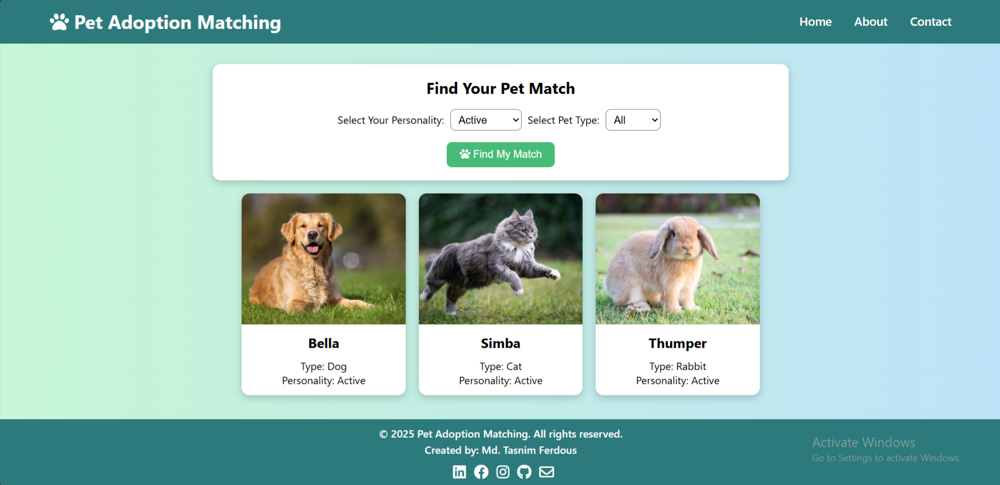

# 🐾 Pet Adoption Matching

A personality-based pet adoption website that helps users find their perfect furry companion. Whether you're calm, active, playful, or protective — there's a pet out there just for you.

## 🌐 Live Preview
[Click to Visit the Site](https://tasnim-ferdous.github.io/Websites/Pet%20Adoption%20Matching/index.html)

---

## 📷 Screenshot


---

## 📌 Features

- 🔍 Match pets based on your personality and preferred pet type
- 🐶 Supports dogs, cats, and rabbits
- 💡 Clean, responsive UI with animated cards
- 📱 Mobile-friendly design
- 💻 Built with plain HTML, CSS, and JavaScript

---

## 🛠️ Tech Stack

- **HTML5** – Structure
- **CSS3** – Styling and responsive design
- **JavaScript (Vanilla)** – Interactivity and filtering logic
- **Font Awesome** – Icons
- **Google Fonts** – Fonts

---

## 📁 Folder Structure

```
📦 Pet-Adoption-Matching
 ┣ 📦 Favicon           # Favicon image folder
 ┣ 📦 Images            # Pet images folder
 ┣ 📜 index.html        # Main landing page
 ┣ 📜 about.html        # About page
 ┣ 📜 contact.html      # Contact info page
 ┣ 📜 style.css         # Styling for all pages
 ┣ 📜 script.js         # Matching logic and UI interactivity
 ┣ 📜 README.md         # You're reading it!
 ┗ 📜 LICENSE           # MIT License
```

---

## ✨ Creator

Made with love by **Md. Tasnim Ferdous**  
💌 [tasnimferdous2007@gmail.com]  
🔗 [LinkedIn](https://www.linkedin.com/in/md-tasnimferdous/)

---

## 🚀 How to Run Locally

1. Clone the repository:
   ```bash
   git clone https://github.com/Tasnim-Ferdous/Websites.git
   ```
2. Navigate to the project folder:
   ```bash
   cd Websites/Pet\ Adoption\ Matching
   ```
3. Open `index.html` in your browser.

---

## 🐛 Contributing & Feedback

Have an idea? Found a bug?  
Feel free to [open an issue](https://github.com/Tasnim-Ferdous/Websites/tree/Website/Pet%20Adoption%20Matching) or fork the project and submit a PR.

---

## 📄 License

This project is open-source and free to use under the [MIT License](LICENSE).

---

### ❤ Special Thanks

To all pet lovers who believe that every animal deserves a forever home 🏡🐾